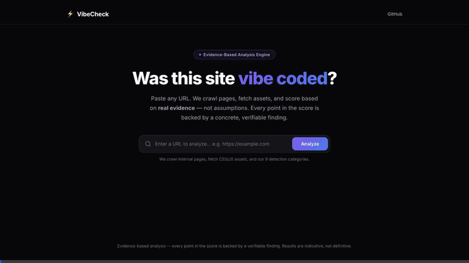

# ⚡ VibeCheck — Vibe Coding Detector

> Paste any URL. Find out if the site was vibe coded.


<p align="center">
  
</p>

<p align="center">
  📖 <a href="https://jabbleashish.blogspot.com/2026/03/tool-that-detects-if-website-was-vibe.html"><b>Read the full blog post →</b></a>
</p>

## The Problem

"Vibe coding" — building entire websites by prompting AI tools like **v0**, **Bolt.new**, **Lovable**, **Cursor**, and others — has exploded in popularity. While this unlocks incredible speed, it also introduces real concerns:

- **Quality & Maintainability**: Vibe-coded sites often ship with deeply nested DOM trees, generic placeholder copy, unused boilerplate, and cookie-cutter layouts that become technical debt.
- **Authenticity & Trust**: Clients, employers, and users increasingly want to know whether a site was genuinely crafted or rapidly generated. Portfolios filled with AI output misrepresent skill.
- **Security & Best Practices**: Auto-generated code frequently skips fundamentals — proper SEO metadata, `robots.txt`, accessibility, error handling — creating hidden risks.
- **Hiring & Evaluation**: When reviewing developer portfolios or freelance deliverables, there's no easy way to distinguish handcrafted work from AI-assembled output.

**There was no tool to answer the simple question: _"Was this website vibe coded?"_**

## The Solution

**VibeCheck** is a web-based analysis engine that scans any public URL and produces a **Vibe Score (0–100)** with a detailed breakdown across 7 detection categories. It uses heuristic pattern matching — no AI/LLM is used in the analysis itself — to look for the telltale fingerprints that AI-assisted code generators leave behind.

### Detection Categories

| Category | What It Checks | Weight |
|----------|---------------|--------|
| 🤖 **AI Platform Signatures** | v0.dev data attributes, Bolt.new markers, Lovable/GPTEngineer references, Replit domains, meta generator tags | 30% |
| 🧩 **UI Library Patterns** | shadcn/ui class combos, Radix UI `data-radix-*` attributes, shadcn CSS variables (`--radius`, `--primary`), Lucide icons | 15% |
| ⚡ **Framework Detection** | Next.js (`__next`, `_next/static`), Vite module scripts, React root markers, Nuxt, Astro, SvelteKit | 10% |
| 📝 **Content Signals** | Generic marketing phrases ("Transform your…", "Revolutionize…"), stock image CDNs, placeholder text, generic CTAs | 15% |
| 🔬 **Code Style Analysis** | DOM nesting depth, Tailwind utility-class density, AI-style HTML comments, inline event handlers | 10% |
| 🚀 **Deployment Signals** | Vercel/Netlify/Railway headers & domains, missing `robots.txt`, missing `sitemap.xml` | 10% |
| 🎨 **Design Patterns** | Glassmorphism (backdrop-blur), gradient overuse, cookie-cutter section layouts, card grids, neon/glow effects | 10% |

### Verdict Scale

| Score | Verdict |
|-------|---------|
| 🟢 0–25 | Likely Human-Crafted |
| 🟡 26–50 | Mixed Signals |
| 🟠 51–75 | Probably Vibe Coded |
| 🔴 76–100 | Almost Certainly Vibe Coded |

Each finding includes a **confidence level** (High / Medium / Low) and supporting evidence, so you can judge for yourself.

## How to Run

### Prerequisites

- **Python 3.9+** installed on your machine
- **pip** (comes with Python)

### 1. Clone the Repository

```bash
git clone https://github.com/ashish-jabble/vibe-check.git
cd vibe-check
```

### 2. Create a Virtual Environment

```bash
python3 -m venv venv
source venv/bin/activate        # macOS / Linux
# venv\Scripts\activate          # Windows
```

### 3. Install Dependencies

```bash
pip install -r requirements.txt
```

### 4. Start the Server

```bash
python app.py
```

The app will be available at **http://127.0.0.1:5000**.

### 5. Analyze a Site

1. Open `http://127.0.0.1:5000` in your browser.
2. Paste any public URL into the input field.
3. Click **Analyze** and wait a few seconds.
4. Review the Vibe Score and detailed category breakdown.

## Project Structure

```
vibe-check/
├── app.py                  # Flask server — serves UI & /api/analyze endpoint
├── analyzer.py             # Core detection engine — 7 category heuristics
├── requirements.txt        # Python dependencies
├── .gitignore              # Git ignore rules
├── README.md               # You are here
├── static/
│   ├── css/
│   │   └── style.css       # Premium dark UI with animations
│   └── js/
│       └── app.js          # Frontend logic — form, loading, results
└── templates/
    └── index.html          # Main HTML template
```

## API Usage

You can also call the analysis engine directly via the API:

```bash
curl -X POST http://127.0.0.1:5000/api/analyze \
  -H "Content-Type: application/json" \
  -d '{"url": "https://example.com"}'
```

**Response:**

```json
{
  "url": "https://example.com",
  "overall_score": 42,
  "verdict": "Mixed Signals",
  "verdict_emoji": "🟡",
  "categories": {
    "ai_platforms": { "name": "AI Platform Signatures", "score": 0, "findings": [] },
    "ui_libraries": { "name": "UI Library Patterns", "score": 36, "findings": [...] },
    ...
  }
}
```

## Limitations

- **Heuristic-based**: Results are indicative, not definitive. A high score doesn't guarantee AI generation; a low score doesn't guarantee human authorship.
- **Static analysis only**: The tool fetches raw HTML via `requests` — it does not execute JavaScript. SPAs that rely heavily on client-side rendering may show fewer signals.
- **False positives**: Legitimate sites using shadcn/ui, TailwindCSS, or Vercel may trigger some signals. The weighted scoring system mitigates this.
- **Evolving landscape**: As AI tools mature, their output patterns will change. The heuristics will need regular updates to stay relevant.

## Contributing

Contributions are welcome! Some ideas:

- Add new heuristics for emerging AI tools (Windsurf, Replit Agent, etc.)
- Improve scoring weights based on empirical testing
- Add JavaScript rendering support (Playwright/Selenium)
- Build a browser extension for inline analysis
- Create a public API with rate limiting

## License

MIT — use it however you like.
